# Module 2
Welcome to module 2!

## Lecture
Here is an example of a pdf embedded:

## Lab

In this lab, we'll demo a popular tool and resources related to exploring our data and potentially finding datasets of interest.

The only requirements for the tutorial are as follows:
1) An internet connection
2) A modern browser
3) An account with COSMIC : https://cancer.sanger.ac.uk/cosmic/register

#### Learning Objectives
- How to use IGV browser to explore datatypes : BAMs, VCFs, BEDs
- How to browse and make use of the visualization functions in cBioPortal
- How to browse and make use of the visualization functions in COSMIC

### Part 1 \- IGV

#### Learning Objectives
- How to use IGV browser to explore datatypes : BAMs, VCFs, BEDs 
- How to traverse the genome
- Loading Tracks and annotations
- How to find additional info for each genomic feature

__To get started, Please navigate to over to [https://igv.org/app/](https://igv.org/app/)__

#### Bams

Navigate over to [https://igv.org/app/](https://igv.org/app/)

- Question : Aside from avoiding installation issues, a browser version is much more convenient and accessible. Why should one consider using a local installation of IGV vs online one?
  - <span style="background-color: black;">1\) Data size \- Imagine streaming multiple 500 GB files</span>
  - <span style="background-color: black;">2\) Data protection \- if you're working with sensitive data that is under DACO restriction or patient data, you're limited by where you store and send the data</span>


Make sure our build is on `Hg38`, to do so click "Genome" and navigate the dropdown to find GRCh38/hg38

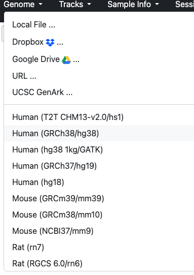

Let's load our data, __select tracks and from the dropdown URL__, 

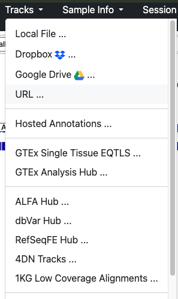

Paste the following info, ensure the __BAM file goes into the Track__ and __index file into index__:

```shell
https://42basepairs.com/download/s3/gatk-test-data/wgs_bam/NA12878_20k_hg38/NA12878.bam
https://42basepairs.com/download/s3/gatk-test-data/wgs_bam/NA12878_20k_hg38/NA12878.bai
```

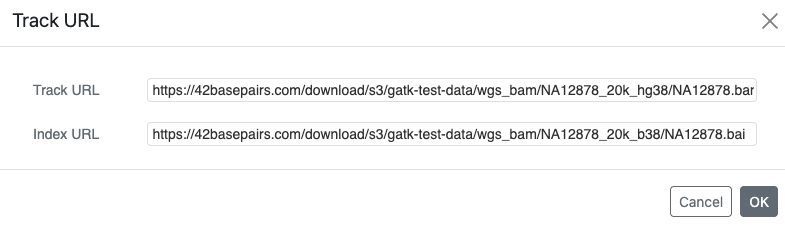

What do we see after loading?

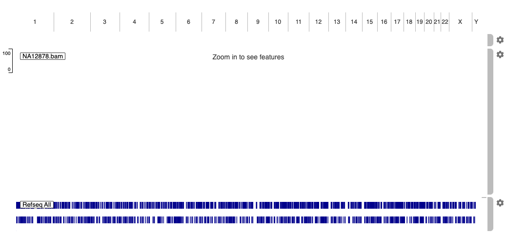

Question : We don't see much. How come?
  - <span style="background-color: black;">One possibility is wrong genome build. Not the case here but a possibility. </span>
  - <span style="background-color: black;">In both the browser and local version of IGV, the number of reads visualized is limited, especially at whole genome view that's an overwhelming amount of data to visualize. For the browser, can call it a limitation or sanity preservation function. Imagine everyone in the room trying to load a 1TB BAM. Local version can adjust settings limited by hardware. </span>

Let's zoom in to a more manageable view. __Paste the following coordinates into the search bar__
```shell
chr1:143,220,111-143,221,807
```


Once the result loads, what do we see?  
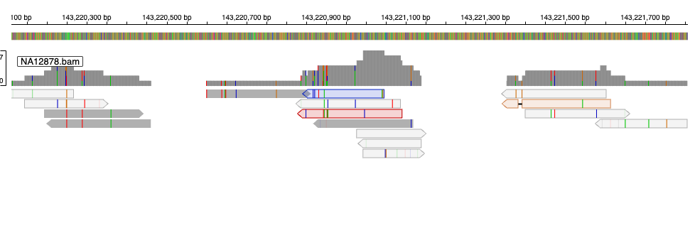

- Question : What are the grey lines? What do the ends (sharp vs blunt) represent?
    - <span style="background-color: black;">Strand Direction</span>
- Question : What are the colour dashes in each block?
    - <span style="background-color: black;">Mismatches</span>
- Question : What is the graph bar above?
    - <span style="background-color: black;">Coverage, the height represents the amount of reads per BP. If coloured, shows the ratio of mismatches per nucleotide</span>

When hovering over a read, its info can be displayed.

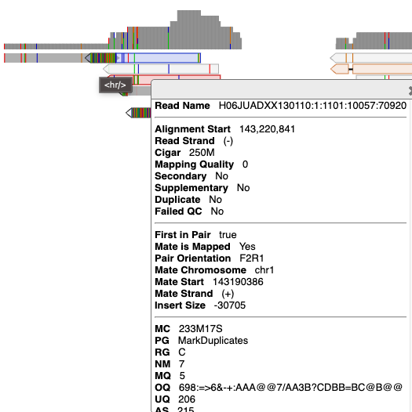

- Question : What do the blue, red and orange reads represent?  
  - <span style="background-color: black;"> When compared to the grey reads, the reads are identified due to their abnormal insert size. The causes could vary from a genomic feature (e.g. structural variant), RNA-seq (though not in this case), lack of size selection during library prep (there would be other signs as well)  </span>
    
    
Let's try a different region

```shell
chr2:32,915,196-32,917,755
```

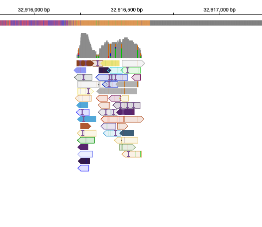

- What genes are these reads at? How would we find out?
- RefSeq is already loaded. We can try another annotation
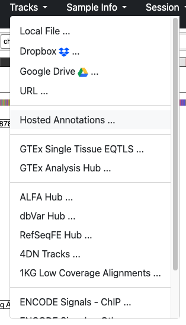
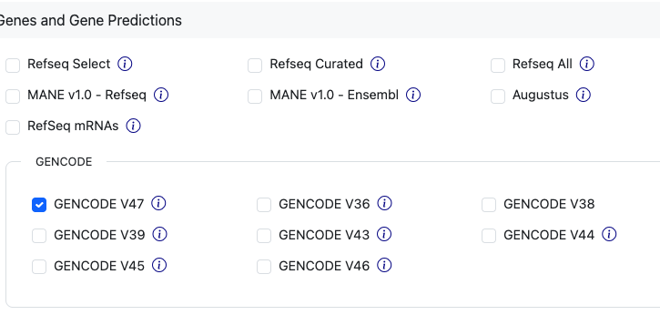 
We can see that the read intersects a "lncRNA" (long non-coding RNA). 
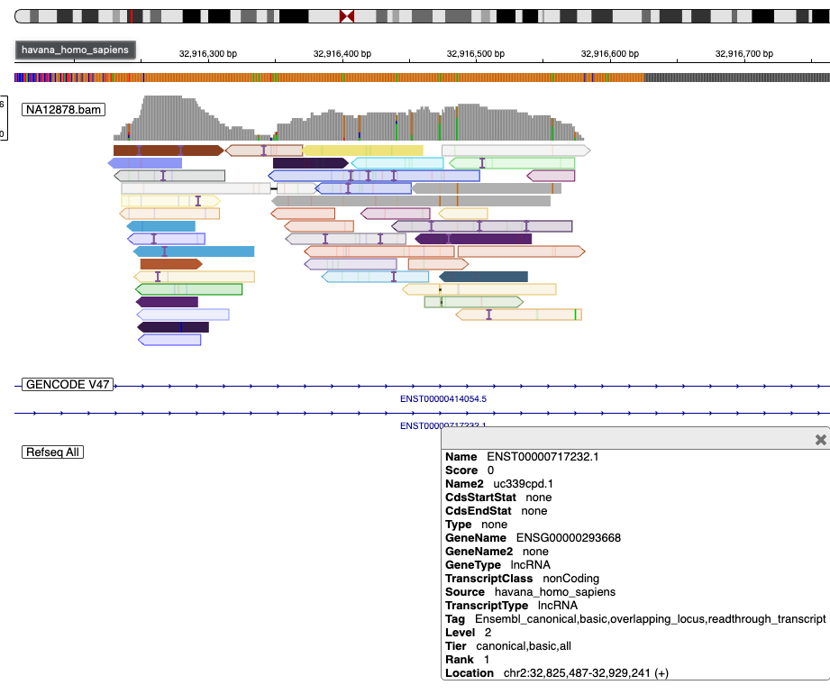 

#### VCFs

Let's load a VCF

```shell
https://42basepairs.com/download/web/giab/data_somatic/HG008/NIST/HG008-T_bulk/20240508p100/analysis/GRCh38/BCM_Revio_HG008T-p100_20260313/HG008-T_vs_HG008-N-P/small_variants/HG008-N-P.dipcall.germline.vcf.gz
https://42basepairs.com/download/web/giab/data_somatic/HG008/NIST/HG008-T_bulk/20240508p100/analysis/GRCh38/BCM_Revio_HG008T-p100_20260313/HG008-T_vs_HG008-N-P/small_variants/HG008-N-P.dipcall.germline.vcf.gz.tbi
```

And then navigate to the coordinates :

```shell
chr1:143,206,141-143,206,141
```

Let's note what we see:  
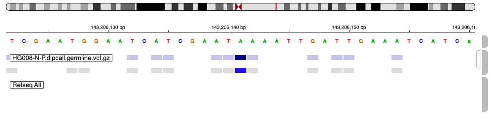 
Focusing on the non-greyed feature, what are the VCF features? Use the name and hover over the item for more information

- Question : What type of variant is it?
  - <span style="background-color: black;"> SNP according to the "type"</span>
- Question : What are the feature's coordinates?
  - <span style="background-color: black;"> Can be found under "LOC"</span>
- Question : What is the reference vs alt?
  - <span style="background-color: black;"> "REF" represents the sequence found in the reference genome. "ALT" represents the sequence that was found in the sample. In this case it was a "G" vs "A" thus the SNP </span>
- Question : What is the depth?
  - <span style="background-color: black;"> AD stands for allelic depth and represents the evidence/reads supporting each allele. It's interpreted by the genotype "A | G" and "70,2" meaning 70 reads support the reference and 2 reads support the allele.</span>
- Question : Compared to the features beside it, why are those features greyed out?
  - <span style="background-color: black;"> Other SNPs were filtered, for the specific reason, see the "Filter" section. Definitions for the filter are likely to be found within the header of the VCF file. </span>

Let's load another feature

```shell
https://42basepairs.com/download/web/giab/data_somatic/HG008/NIST/HG008-T_bulk/20240508p100/analysis/GRCh38/BCM_Revio_HG008T-p100_20260313/HG008-T_vs_HG008-N-P/structural_variants/HG008T-p100.severus.somatic.vcf.gz
https://42basepairs.com/download/web/giab/data_somatic/HG008/NIST/HG008-T_bulk/20240508p100/analysis/GRCh38/BCM_Revio_HG008T-p100_20260313/HG008-T_vs_HG008-N-P/structural_variants/HG008T-p100.severus.somatic.vcf.gz.tbi
```

And let's navigate to :

```shell
chr1:89,158-89,196
```

Let's note what we see:  
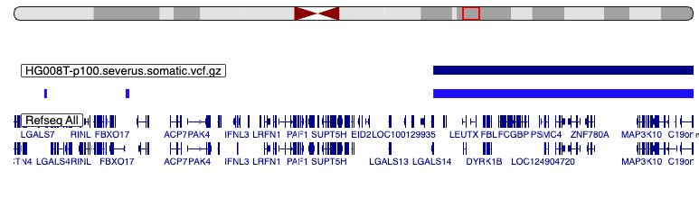 

Notice the huge feature that's been flagged.

- Question : What type of variant is it?
  - <span style="background-color: black;"> It is a structural variant. Much larger than the single base of SNVs. The Alt also indicates it is a deletion event.</span>
- Question : How long is the feature?
  - <span style="background-color: black;"> ~10Kb according to the SV length field </span>
- Question : What is the feature's "ID" and what purpose does the ID field serve?
  - <span style="background-color: black;"> "severus_DEL3275" and to act as a unique identifier </span>
- Question : How would we find out how many genes are affected by the feature?
  - <span style="background-color: black;"> The BCFtools Consequence or BCSQ identifies the genes affected.  </span>

#### Bed

Let's explore bed files. Load the following URL into the track
```
https://hgdownload.soe.ucsc.edu/gbdb/hg38/encode4/ccre/encodeCcreRegistry.bb
```

- Question : Notice anything different with the file suffix?
  - <span style="background-color: black;">It is a big bed file. The same as a regular bed file but binarized for accessibility. To find out more see the following [link](https://genome.ucsc.edu/goldenPath/help/bigBed.html)</span>

How to interpret the features described by the bed file? The UCSC genome browser describes the file in great detail, specifically: 
 

For more info see the following [link](https://genome.ucsc.edu/cgi-bin/hgTrackUi?hgsid=4159675625_pMjcCAWJ0iqsyPdZ6WOQ6gMFIklH&db=hg38&c=chr7&g=cCREregistry)

If we navigate to `TP53` by typing `TP53` in the search bar, we see the following:
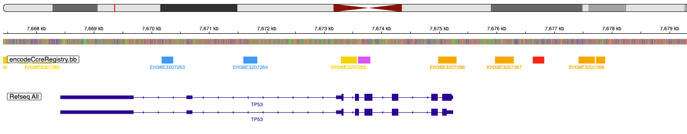

- Question : What is the red feature? What is the importance of the feature and where it is located?
  - <span style="background-color: black;">It is a promoter. Per the RefSeq location, it is a bit odd. It's expected to be near gene starts. This suggests an alternative start site that can be verified through other annotations such as GENCODE V39</span>

### Part 2 \- cBioPortal

#### Learning Objectives
- How to browse and make use of the visualization functions in cBioPortal
- Learn to query genes and datasets of interest
- Make use of visualizations to discover relationships and biological trends

Firstly, what is cBioPortal? [As per their about page, Multimodal data represented in interactive visualizations that facilitates biological discovery and clinical decisions](https://about.cBioPortal.org/).

Navigate to [https://www.cBioPortal.org/](https://www.cBioPortal.org/) and select the following two studies:   
  - Breast Cancer (METABRIC, Nature 2012 & Nature Commun 2016\)  
  - Breast Invasive Carcinoma  (TCGA, PanCancer Atlas)

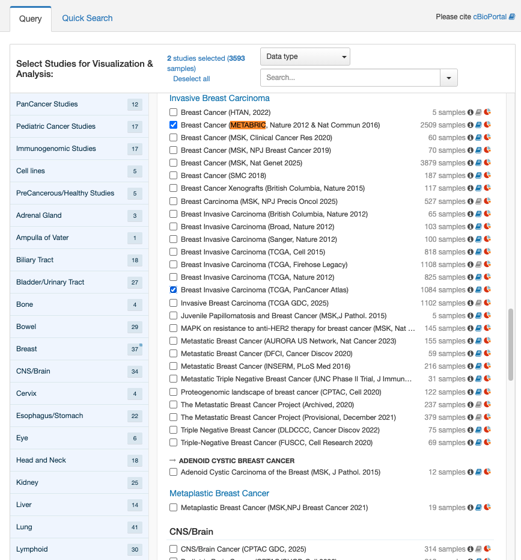 

Click "query by gene" at the footer and query the following :
```
BRCA1 BRCA2 TP53 PTEN STK11 CDH1 PALB2 CHEK2 ATM BARD1 RAD51C RAD51D FGFR2 TOX3 MAP3K1 ESR1 ERBB2 PIK3CA GATA3
```
 
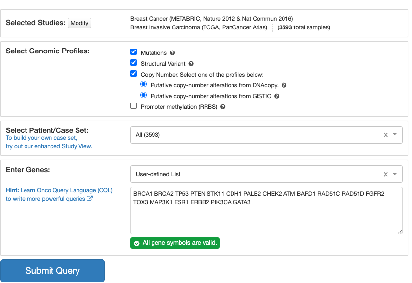  

We are presented with a heatmap  
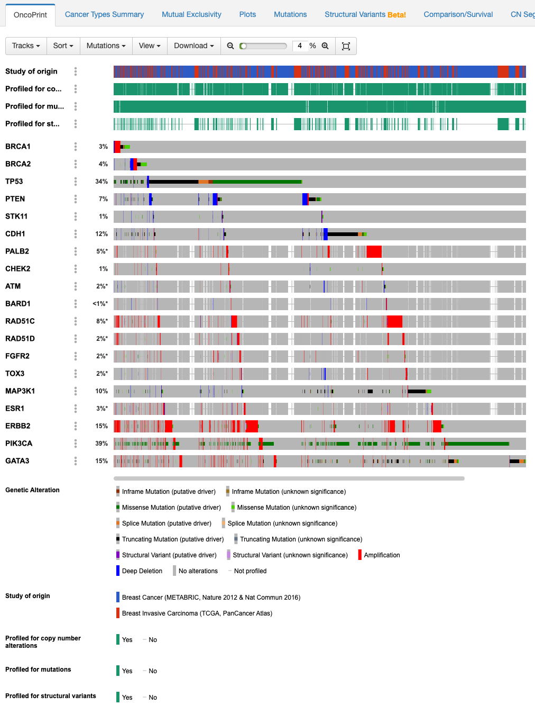 
- Question : What do the first four rows present and mean?
  - <span style="background-color: black;">As indicated in the legend, the first four rows provide info on donors' membership to respective datasets and whether they were profiled for copy number changes, mutations, and structural mutations.</span>
- Question : We see multiple genes, focusing on `TP53` and `PIK3CA`, what can we infer?
  - <span style="background-color: black;"> The percentage represents the number of donors with genetic alterations, where the legend specifies the type and proportion of donors</span>

On the above tabs, navigate to the cancer types summary view   

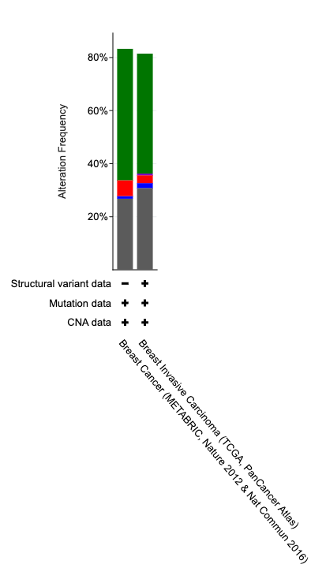

- Question : What does the barchart summarize for us?
  - <span style="background-color: black;"> X-axis gives info on the dataset and included profiled genomic alteration types. The Bars provide a frequency of genomic alterations.</span>

Moving on to mutual exclusivity, select significant only and sort by q-value starting with lowest/most significant

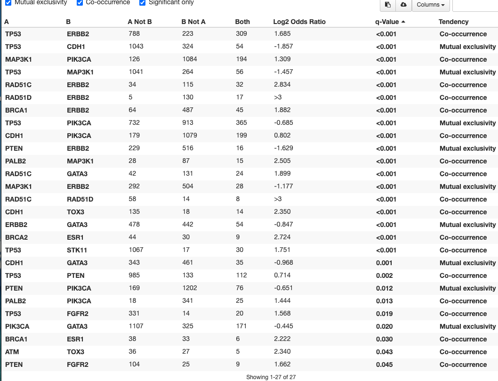

The first row denotes TP53 and ERBB2.
- Question : What does the finding of Co-occurrence entail?
    - <span style="background-color: black;">Based on the two datasets, TP53 and ERBB2 are often both found to be altered</span> 
  - [Perhaps an interesting link to look at](https://pmc.ncbi.nlm.nih.gov/articles/PMC3465532/#:~:text=The%20HER2%2DEnriched%20subtype%20\(HER2E\)%2C%20which%20has%20frequent%20HER2/ERBB2%20amplification%20\(80%25\)%2C%20had%20a%20hybrid%20pattern%20with%20a%20high%20frequency%20of%20TP53%20\(72%25\)%20and)

Looking at the second row of TP53 and CDH1
  - Question : What does the finding of mutual exclusivity entail?
    - <span style="background-color: black;">Very few examples exist in the two breast cancer datasets where both TP53 and CDH1 co-occur, in fact most donors have one or the other. This could signify a dependency specific to the cancer type.</span>

Exploring the plots tab next. Let's use the quick filter for FGA vs Dx

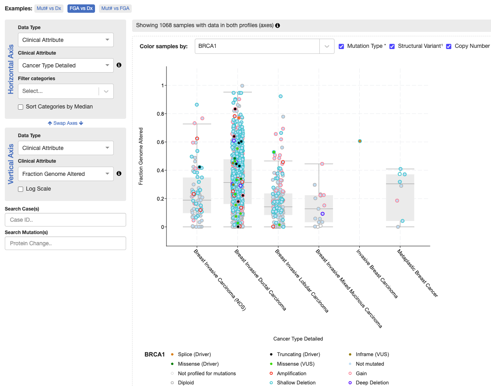 

  - Question: What info can we glean from the plot? 
    - <span style="background-color: black;">The TCGA datasets are split up into various types of Breast carcinomas. Breast invasive ductal carcinoma shows the highest fraction of genome altered, signifying genomic instability.</span>

- Let's look at the mutations tab, specifically for gene TP53 

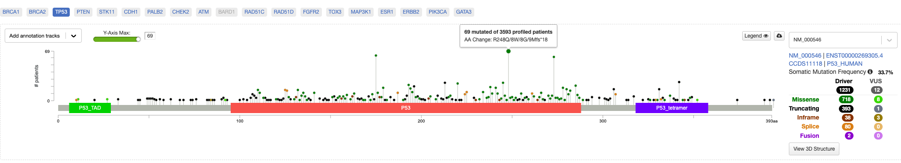  

  - Let's look at the mutation with the highest donor count  
    - Question: Where does it occur in TP53?
      - <span style="background-color: black;">in the P53 region that binds DNA. Amino acid 248</span>  
    - Question: What type of mutation is it?
      - <span style="background-color: black;"> Different types, but often missense</span>  
    - Question: Are there any Post-Translational Modifications associated with the mutation?
      - <span style="background-color: black;">On the left, we can add annotation tracks. Specifically we're interested in Post-Translational Modifications (PTM). Scrolling around, no modification coincides with the mutation.</span>  
  
Speaking of annotations, what if we wanted to find out more about the mutation? What can we look up through OncoKB?

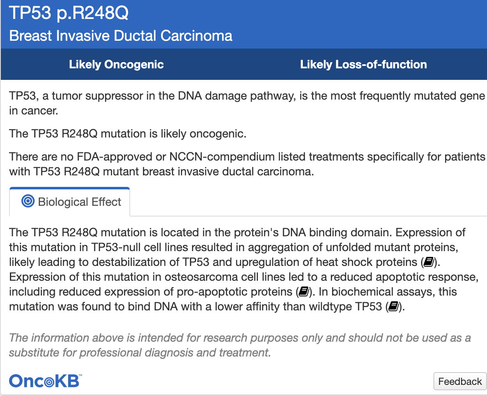  
Hovering over 
- first row in the below table of mutation of sample ID `MB-0211` with the protein change `R248Q`
- the dartboard icon under column annotation


- Looking at survival curves. 
  - Question: What can we understand about TP53 vs unaffected cohort?
    - <span style="background-color: black;">Patients with TP53 mutations initially have poorer survival odds but around 180-200 months, have better outcomes compared to the unaffected cohort.</span>
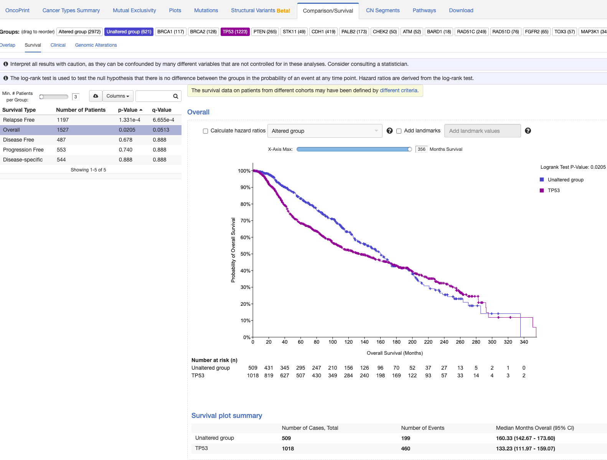  

- Lastly, let's look at copy number segments which brings us back to IGV. If we look at PIK3CA vs TP53, 
  - Question: what differences do we observe?
    - <span style="background-color: black;">TP53 mutations are copy number losses while PIK3CA mutations are copy number gains.</span>

### Part 3 \- COSMIC

#### Learning Objectives
- How to browse and make use of the visualization functions in COSMIC
- Navigate datasets by refining the search using visualization functions 

Navigate to [COSMIC](https://cancer.sanger.ac.uk/cosmic). You'll need an account to access the data. Follow the prompts at the following link : https://cancer.sanger.ac.uk/cosmic/register

Search for `TP53` in the header search bar


The central gene view plot displays various types of info along the length of the gene.

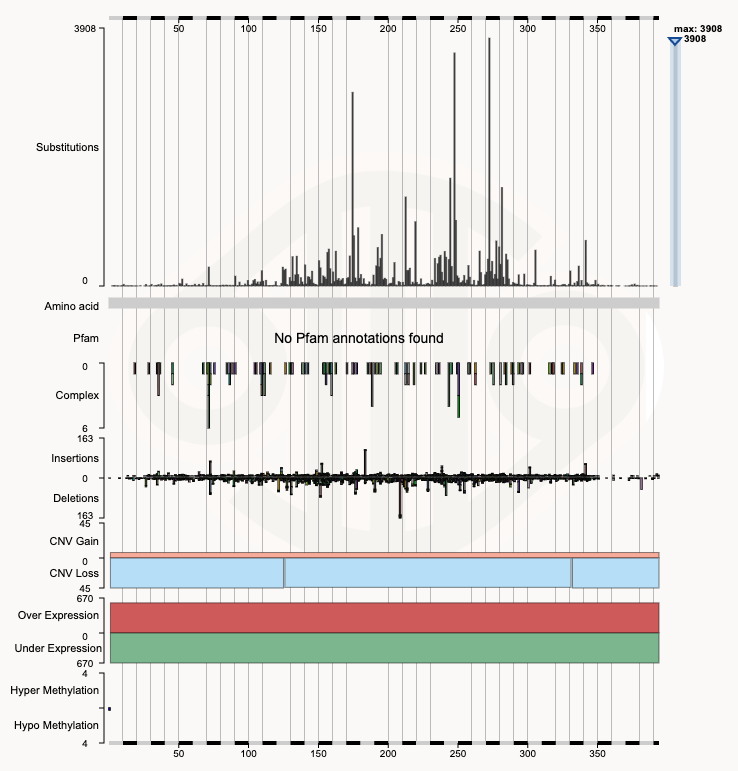

Hovering on the top substitution, we'll find the position to be `273`. We can further zoom in to that region for more info. Applying the filters on the left-hand side for `270-275`.

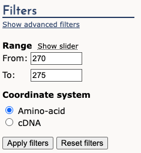

The result is the following barchart of substitutions.

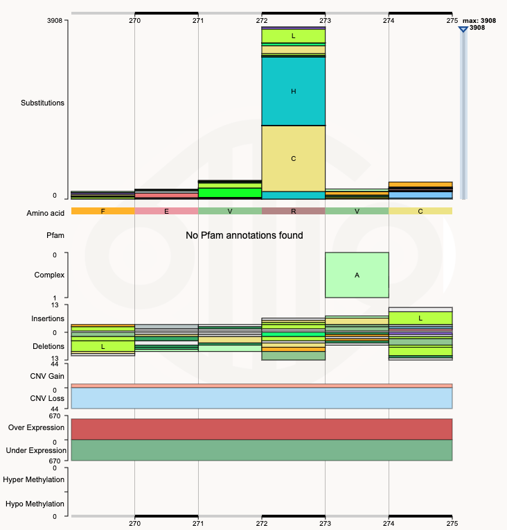

  - Question : Which substitution is the most common at position `273` of the TP53 gene?
    - <span style="background-color: black;">p.R273H (c.818G>A) 1551</span>

Clicking on the mutation brings us to a page dedicated to the mutation. Here, a number of interesting things can be viewed, including samples with the mutation, related references, and pathways.

We can also observe the tissue type distribution of samples with the TP53 mutations 

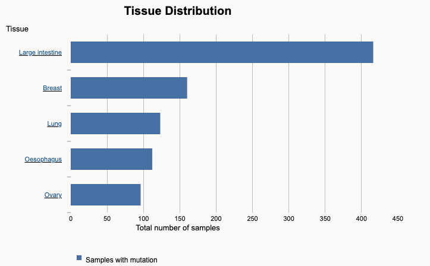

Clicking on the `Large Intestine` brings us to a page dedicated to `Large Intestine`. 

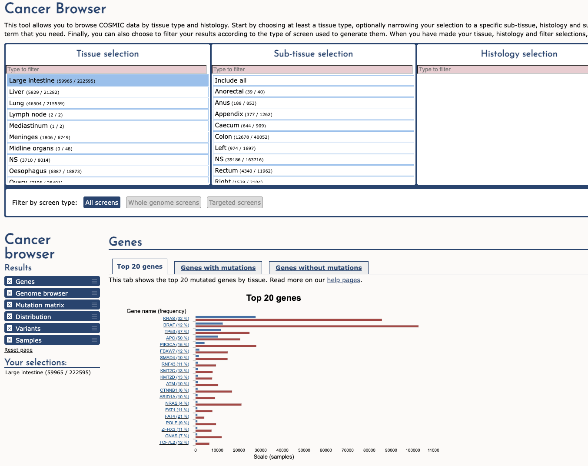

We can then see the top genes mutated in Large intestinal samples. Clicking the TP53 mutation returns us to the TP53 page but with additional filters.

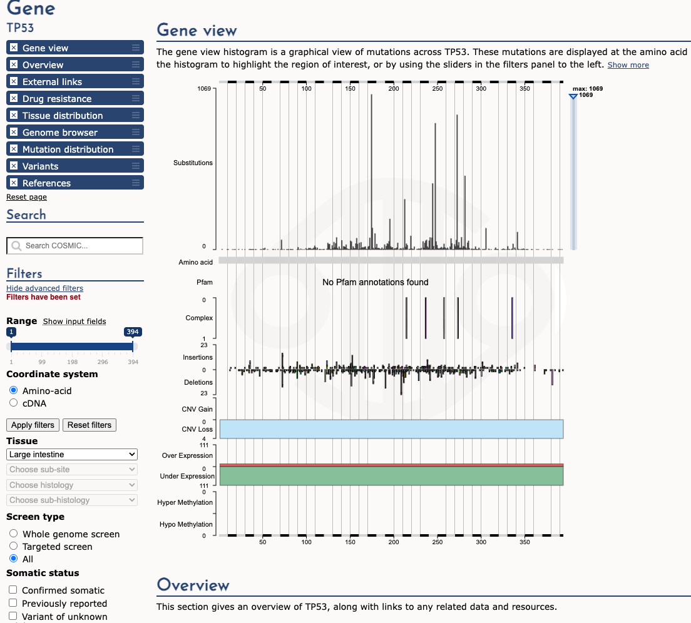

Note the left-hand filter with tissue type selection applied. The result is that the most represented mutation is now different.