# Module 2
Welcome to module 2!

## Lecture
Here is an example of a PDF embedded:

## Lab

In this lab, we'll demo a popular tool and resources related to exploring our data and potentially finding datasets of interest.

The only requirements for the tutorial are as follows:
1) An internet connection
2) A modern browser
3) An account with COSMIC : https://cancer.sanger.ac.uk/cosmic/register

#### Learning Objectives
- How to use IGV browser to explore data types : BAMs, VCFs, BEDs
- How to browse and make use of the visualization functions in cBioPortal
- How to browse and make use of the visualization functions in COSMIC

### Part 1 - IGV

#### Learning Objectives
- How to use IGV browser to explore data types : BAMs, VCFs, BEDs 
- How to traverse the genome
- Loading Tracks and annotations
- How to find additional info for each genomic feature

__To get started, Please navigate over to [https://igv.org/app/](https://igv.org/app/)__

- Question : Aside from avoiding installation issues, a browser version is much more convenient and accessible. Why should one consider using a local installation of IGV vs the online version?
  - <span style="background-color: black;">1) Data size - Imagine streaming multiple 500 GB files</span>
  - <span style="background-color: black;">2) Data protection - if you're working with sensitive data that is under DACO restriction or patient data, you're limited by where you store and send the data</span>

#### BAM

##### Step 1 – Open IGV-Web and choose the genome

Make sure our build is on `Hg38`, to do so click "Genome" and navigate the dropdown to find GRCh38/hg38

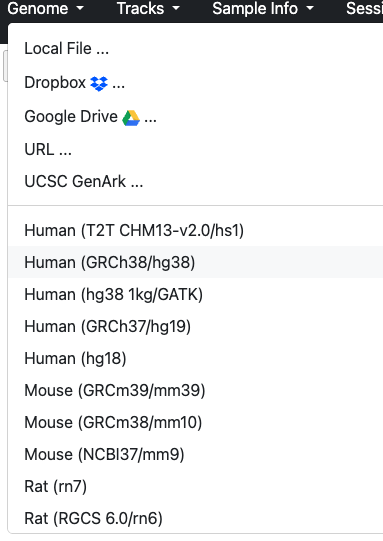

Let's load our data, __select Tracks, then URL from the dropdown__, 

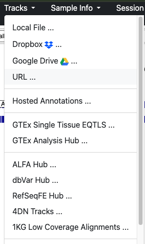

##### Step 2 – Loading the BAM and Index

Paste the following info, ensure the __BAM file goes into the Track__ and __index file into index__:

```shell
https://42basepairs.com/download/s3/gatk-test-data/wgs_bam/NA12878_20k_hg38/NA12878.bam
https://42basepairs.com/download/s3/gatk-test-data/wgs_bam/NA12878_20k_hg38/NA12878.bai
```
NA12878 is the GIAB/1000 Genomes reference individual. This BAM is a very small subset of a whole-genome run: about 61,000 mapped reads across the whole genome, compared with hundreds of millions in a real 30× genome. It is meant for teaching.

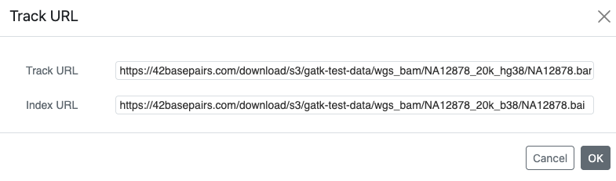

##### Step 3 – Post loading sanity check

What do we see after loading?

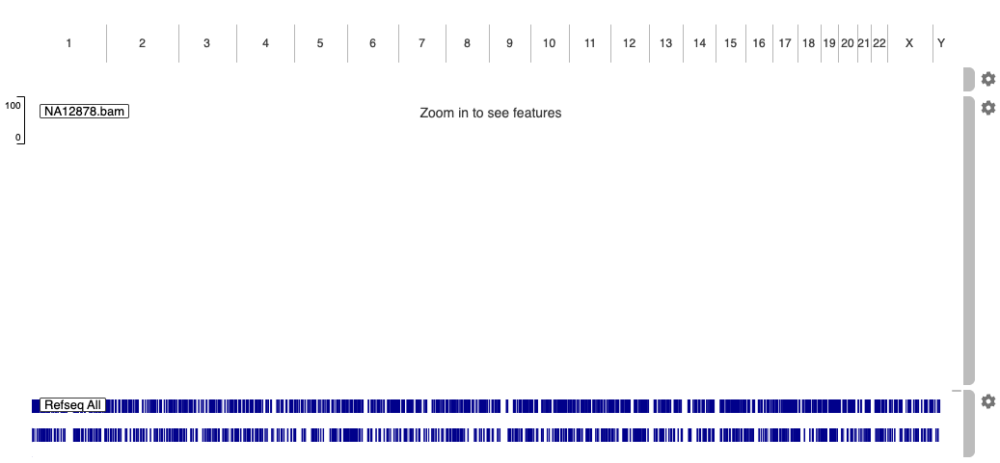

Question : We don't see much. How come?
  - <span style="background-color: black;">One possibility is wrong genome build. Not the case here but a possibility. </span>
  - <span style="background-color: black;"> The toy BAM being examined is also very small in comparison. So the reads representation will be sparse. </span>
  - <span style="background-color: black;">In both the browser and local version of IGV, the number of reads visualized is limited, especially at whole genome view that's an overwhelming amount of data to visualize. For the browser, imagine everyone trying to load a 1TB BAM. Local version can adjust settings according to hardware limitations. </span>

##### Step 4 – Zoomed in look

Let's zoom in to a more manageable view. __Paste the following coordinates into the search bar__
```shell
chr1:143,220,111-143,221,807
```


Once the result loads, what do we see?  
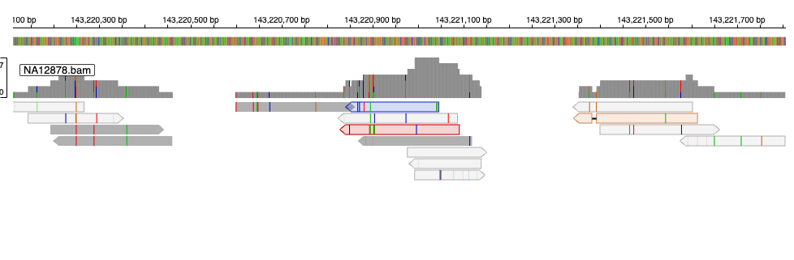

- Question : What are the grey lines? What do the ends (sharp vs blunt) represent?
    - <span style="background-color: black;">Each grey bar is a read. The pointed end shows the direction it was sequenced: pointing right = forward (+) strand, pointing left = reverse (−).</span>
- Question : What are the colour dashes in each block?
    - <span style="background-color: black;">Mismatches</span>
- Question : What is the graph bar above?
    - <span style="background-color: black;">Coverage, the height represents the amount of reads per BP. If coloured, shows the ratio of mismatches per nucleotide</span>

##### Step 5 – Read features


Clicking on a read, its info can be displayed.

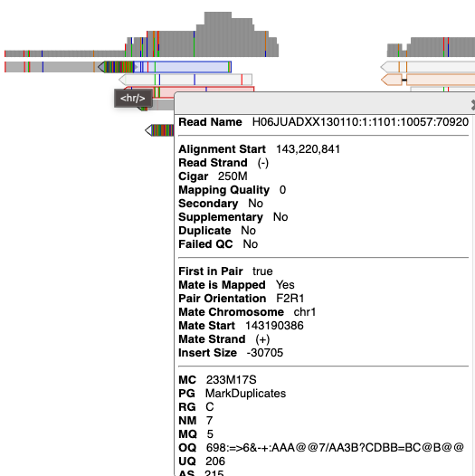

- Question : What do the blue, red and orange reads represent?  
  - <span style="background-color: black;"> When compared to the grey reads, the reads are identified due to their abnormal insert size. The causes could vary from a genomic feature (e.g. structural variant), RNA-seq (though not in this case), lack of size selection during library prep (there would be other signs as well). Toggleable via the gear icon on the right side of the track. Select under "Color by", "Pair Orientation & insert size (TLEN)" </span>
    
##### Step 6 – Utilizing track annotations

Let's try a different region

```shell
chr2:32,915,196-32,917,755
```

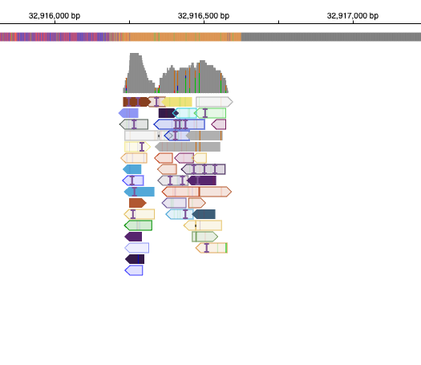

- Question : Why are almost all reads coloured?
  - <span style="background-color: black;"> Similarly to the last question, the reads are highlighted due to the unexpected read orientation. </span>

What genes are these reads at? How would we find out?
- RefSeq is already loaded. We can try another annotation
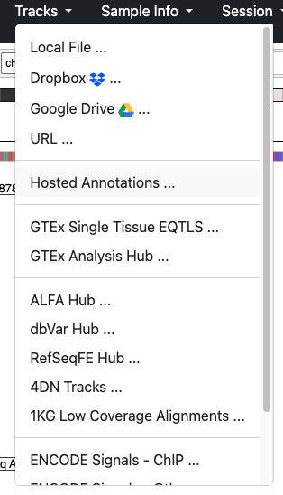
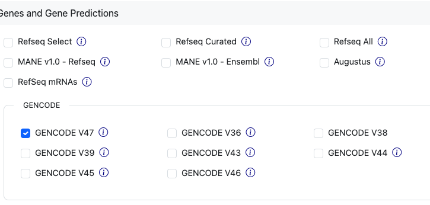 
We can see that the reads intersect a "lncRNA" (long non-coding RNA). 
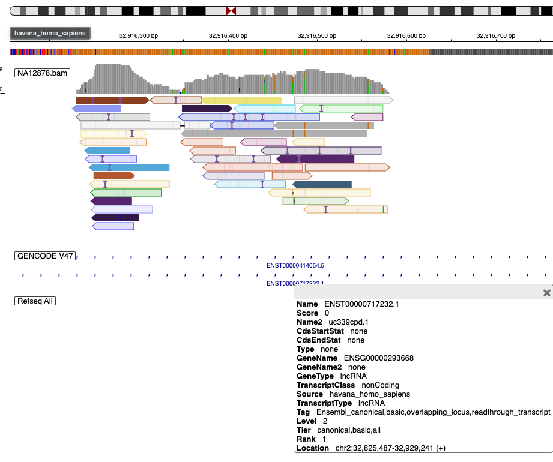 

#### VCF
##### Step 7 – Working with VCFs (Germline SNVs)
Let's load a VCF

```shell
https://42basepairs.com/download/web/giab/data_somatic/HG008/NIST/HG008-T_bulk/20240508p100/analysis/GRCh38/BCM_Revio_HG008T-p100_20260313/HG008-T_vs_HG008-N-P/small_variants/HG008-N-P.dipcall.germline.vcf.gz
https://42basepairs.com/download/web/giab/data_somatic/HG008/NIST/HG008-T_bulk/20240508p100/analysis/GRCh38/BCM_Revio_HG008T-p100_20260313/HG008-T_vs_HG008-N-P/small_variants/HG008-N-P.dipcall.germline.vcf.gz.tbi
```

These VCFs come from `HG008`, the GIAB pancreatic cancer tumour/normal cell-line pair, and not from `NA12878`. The BAM and VCFs belong to different people, so don't expect the reads to support these variants.

Then navigate to the coordinates :

```shell
chr1:143,206,141-143,206,141
```

Let's note what we see:  
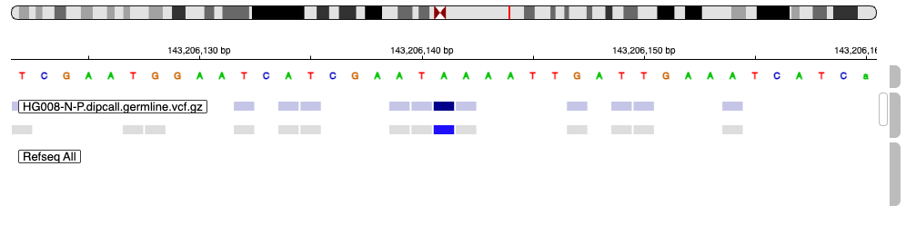 
Focusing on the non-greyed feature, what are the VCF features? Use the name and hover over the item for more information

Additionally, a snippet of the VCF for reference:
```
##fileformat=VCFv4.2
##FILTER=<ID=PASS,Description="All filters passed">
.
.
.
##FORMAT=<ID=GT,Number=1,Type=String,Description="Genotype">
##FORMAT=<ID=AD,Number=R,Type=Integer,Description="Allelic depths for the ref and alt alleles in the order listed">
##FILTER=<ID=HET1,Description="Heterozygous in the first haplotype">
##FILTER=<ID=HET2,Description="Heterozygous in the second haplotype">
##FILTER=<ID=GAP1,Description="Uncalled in the first haplotype">
##FILTER=<ID=GAP2,Description="Uncalled in the second haplotype">
##INFO=<ID=TRF,Number=0,Type=Flag,Description="Entry hits a tandem repeat region">
##INFO=<ID=TRFdiff,Number=1,Type=Float,Description="ALT TR copy difference from reference">
##INFO=<ID=TRFrepeat,Number=1,Type=String,Description="Repeat motif">
##INFO=<ID=TRFovl,Number=1,Type=Float,Description="Percent of ALT covered by TRF annotation">
##INFO=<ID=TRFstart,Number=1,Type=Integer,Description="Start position of discovered repeat">
##INFO=<ID=TRFend,Number=1,Type=Integer,Description="End position of discovered repeat">
##INFO=<ID=TRFperiod,Number=1,Type=Integer,Description="Period size of the repeat">
##INFO=<ID=TRFcopies,Number=1,Type=Float,Description="Number of copies aligned with the consensus pattern">
##INFO=<ID=TRFscore,Number=1,Type=Integer,Description="Alignment score">
##INFO=<ID=TRFentropy,Number=1,Type=Float,Description="Entropy measure">
##INFO=<ID=TRFsim,Number=1,Type=Float,Description="Similarity of ALT sequence to generated motif faux sequence">
##INFO=<ID=END,Number=1,Type=Integer,Description="End position of the variant">
##bcftools_pluginVersion=1.14+htslib-1.21
##bcftools_pluginCommand=plugin fill-tags -Oz -o results/asm_varcalls/GRCh38_HG008N~v6.3-dipz2k/annotations/GRCh38_HG008N-v6.3_dipcall-z2k.trfanno.end_info.vcf.gz -- results/asm_varcalls/GRCh38_HG008N~v6.3-dipz2k/annotations/GRCh38_HG008N-v6.3_dipcall-z2k.trfanno.vcf.gz -t END; Date=Wed Jan 14 14:06:11 2026
##bcftools_viewVersion=1.14+htslib-1.21
##bcftools_viewCommand=view -e ALT="<INV>" -Oz -o results/asm_varcalls/GRCh38_HG008N~v6.3-dipz2k/annotations/GRCh38_HG008N-v6.3_dipcall-z2k.trfanno.end_info.no_inv.vcf.gz results/asm_varcalls/GRCh38_HG008N~v6.3-dipz2k/annotations/GRCh38_HG008N-v6.3_dipcall-z2k.trfanno.end_info.vcf.gz; Date=Wed Jan 14 14:06:28 2026
##HiPhase_version="1.5.0-8af3f1e"
##HiPhase_command="hiphase --bam /mnt/miniwdl_task_container/work/_miniwdl_inputs/0/m84039_250325_050416_s2.hifi_reads.aligned.bam -t 24 --output-bam m84039_250325_050416_s2.hifi_reads.aligned.hiphase.bam --vcf /mnt/miniwdl_task_container/work/_miniwdl_inputs/0/GRCh38_HG008N-v6.3_smvar_dipcall-z2k.vcf.gz --output-vcf GRCh38_HG008N-v6.3_smvar_dipcall-z2k.hiphase.vcf.gz -r /mnt/miniwdl_task_container/work/_miniwdl_inputs/0/GRCh38_GIABv3_no_alt_analysis_set_maskedGRC_decoys_MAP2K3_KMT2C_KCNJ18.fasta --stats-file m84039_250325_050416_s2.hifi_reads.aligned.hiphase.stats --summary-file m84039_250325_050416_s2.hifi_reads.aligned.hiphase.summary.tsv --blocks-file m84039_250325_050416_s2.hifi_reads.aligned.hiphase.blocks.tsv --ignore-read-groups"
##FORMAT=<ID=PS,Number=1,Type=Integer,Description="Phase set identifier">
##FORMAT=<ID=PF,Number=1,Type=String,Description="Phasing flag">
#CHROM  POS     ID      REF     ALT     QUAL    FILTER  INFO    FORMAT  HG008N
chr1    89177   .       A       G       30      .       END=89177       GT:AD   1/1:0,2
chr1    143206141    .    A    G    30    .    TRF;END=143206141    GT:AD    0/1:70,2
```

- Question : What type of variant is it?
  - <span style="background-color: black;"> SNP according to the "type"</span>
- Question : What are the feature's coordinates?
  - <span style="background-color: black;"> Can be found under "LOC"</span>
- Question : What is the reference vs alt?
  - <span style="background-color: black;"> "REF" represents the sequence found in the reference genome. "ALT" represents the sequence that was found in the sample. In this case it was a "A" vs "G" thus the SNP </span>
  - <span style="background-color: black;"> Also take note of the genotype in IGV : "A|G". This notation is different than in the VCF and carries some different interpretations. In VCFs the genotype field can present as `0/1` meaning unphased or `0|1` phased. Being phased means we know which allele belongs on which chromosome copy. The same cannot be said for unphased. Short read sequencing does not provide that resolution, and would need long reads (for example). That context is lost in IGV, and instead IGV displays the alleles as bases, e.g. A|G, using `|` as a fixed separator regardless of phasing.</span>
- Question : What is the depth?
  - <span style="background-color: black;"> "AD" stands for allelic depth and represents the evidence/reads supporting each allele. It's interpreted by the genotype "A | G" and "70,2" meaning 70 reads support the reference and 2 reads support the alt allele.</span>
- Question : Compared to the features beside it, why are those features greyed out?
  - <span style="background-color: black;"> Other SNPs were filtered. For the specific reason, see the "FILTER" section. Definitions for the filter are likely to be found within the header of the VCF file. </span>

##### Step 8 – Working with VCFs (Somatic Structural Variants)
Let's load another feature

```shell
https://42basepairs.com/download/web/giab/data_somatic/HG008/NIST/HG008-T_bulk/20240508p100/analysis/GRCh38/BCM_Revio_HG008T-p100_20260313/HG008-T_vs_HG008-N-P/structural_variants/HG008T-p100.severus.somatic.vcf.gz
https://42basepairs.com/download/web/giab/data_somatic/HG008/NIST/HG008-T_bulk/20240508p100/analysis/GRCh38/BCM_Revio_HG008T-p100_20260313/HG008-T_vs_HG008-N-P/structural_variants/HG008T-p100.severus.somatic.vcf.gz.tbi
```

And let's navigate to :

```shell
chr19:38,760,896-39,923,840
```

Let's note what we see:  
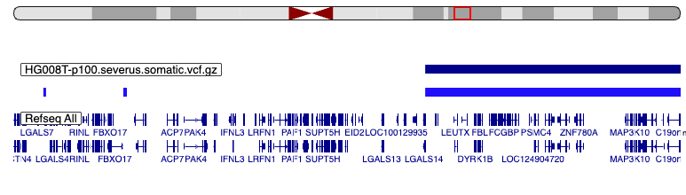 

Notice the huge feature that's been flagged.

For reference, this is how the VCF contents look:
```
##fileformat=VCFv4.2
##FILTER=<ID=PASS,Description="All filters passed">
##source=Severus_v1.6
.
.
.
##ALT=<ID=DEL,Description="Deletion">
##ALT=<ID=INS,Description="Insertion">
##ALT=<ID=DUP,Description="Duplication">
##ALT=<ID=INV,Description="Reciprocal Inversion">
##ALT=<ID=BND,Description="Breakend">
##FILTER=<ID=FAIL_LOWSUPP,Description="Less number of support, but ok in other samples">
##FILTER=<ID=FAIL_MAP_CONS,Description="Majority of variant reads have unreliable mappability">
##FILTER=<ID=FAIL_CONN_CONS,Description="Majority of variant reads have unreliable connections">
##FILTER=<ID=FAIL_LOWCOV_OTHER,Description="Low variant coverage in other samples">
##INFO=<ID=PRECISE,Number=0,Type=Flag,Description="SV with precise breakpoints coordinates and length">
##INFO=<ID=IMPRECISE,Number=0,Type=Flag,Description="SV with imprecise breakpoints coordinates and length">
##INFO=<ID=SVTYPE,Number=1,Type=String,Description="Type of structural variant">
##INFO=<ID=SVLEN,Number=1,Type=Integer,Description="Length of the SV">
##INFO=<ID=END,Number=1,Type=Integer,Description="End position of the SV">
##INFO=<ID=STRANDS,Number=1,Type=String,Description="Breakpoint strandedness">
##INFO=<ID=DETAILED_TYPE,Number=1,Type=String,Description="Detailed type of the SV">
##INFO=<ID=INSLEN,Number=1,Type=Integer,Description="Length of the unmapped sequence between breakpoint">
##INFO=<ID=MAPQ,Number=1,Type=Integer,Description="Median mapping quality of supporting reads">
##INFO=<ID=PHASESETID,Number=1,Type=String,Description="Matching phaseset ID for phased SVs">
##INFO=<ID=HP,Number=1,Type=Integer,Description="Matching haplotype ID for phased SVs">
##INFO=<ID=CLUSTERID,Number=1,Type=String,Description="Cluster ID in breakpoint_graph">
##INFO=<ID=INSSEQ,Number=1,Type=String,Description="Insertion sequence between breakpoints">
##INFO=<ID=MATE_ID,Number=1,Type=String,Description="MATE ID for breakends">
##INFO=<ID=INSIDE_VNTR,Number=1,Type=String,Description="True if an indel is inside a VNTR">
##INFO=<ID=ALIGNED_POS,Number=1,Type=String,Description="Position in the reference">
##INFO=<ID=LOW_COV_IN,Number=1,Type=String,Description="Samples that has low coverage in that region">
##INFO=<ID=INSIDE_WHITELIST,Number=1,Type=String,Description="SVs within the whitelist bed file">
##FORMAT=<ID=GT,Number=1,Type=String,Description="Genotype">
##FORMAT=<ID=DR,Number=1,Type=Integer,Description="Number of reference reads">
##FORMAT=<ID=DV,Number=1,Type=Integer,Description="Number of variant reads">
##FORMAT=<ID=VAF,Number=1,Type=Float,Description="Variant allele frequency">
##FORMAT=<ID=hVAF,Number=3,Type=Float,Description="Haplotype specific variant Allele frequency (H0,H1,H2)">
##INFO=<ID=BCSQ,Number=.,Type=String,Description="Local consequence annotation. Format: Consequence|gene|transcript|biotype|strand|amino_acid_change|dna_change">
##INFO=<ID=hetalt,Number=.,Type=String,Description="Samples with heterozygous REF/ALT genotype">
##INFO=<ID=homalt,Number=.,Type=String,Description="Samples with homozygous ALT/ALT or hemizygous ALT genotype">
#CHROM  POS     ID      REF     ALT     QUAL    FILTER  INFO    FORMAT  m84113_260205_082846_s3.demux.bc2055--bc2055.aligned.hiphase
chr1    151220118       severus_DEL306  N       <DEL>   60      PASS    PRECISE;SVTYPE=DEL;SVLEN=172;END=151220290;STRANDS=+-;MAPQ=60;PHASESETID=151409146|151409146;HP=1;BCSQ=sv:intron|PIP5K1A||protein_coding|+||;hetalt=m84113_260205_082846_s3.demux.bc2055--bc2055.aligned.hiphase        GT:VAF:hVAF:DR:DV       0/1:0.8:0,1,0:5:20
chr1    154714649       severus_BND18941        N       N.      60      PASS    IMPRECISE;SVTYPE=sBND;STRANDS=+;DETAILED_TYPE=loose_end;MAPQ=60;PHASESETID=154791972|154791972;HP=2;BCSQ=sv:intron|KCNN3||protein_coding|-||;hetalt=m84113_260205_082846_s3.demux.bc2055--bc2055.aligned.hiphase        GT:VAF:hVAF:DR:DV       0/1:0.16:0,0,0.26:26:5
```
- Question : What type of variant is it?
  - <span style="background-color: black;"> It is a structural variant. Much larger than the single base of SNVs. The Alt also indicates it is a deletion event.</span>
- Question : How long is the feature?
  - <span style="background-color: black;"> ~10.8 Mb according to the SV length field </span>
- Question : What is the feature's "ID" and what purpose does the ID field serve?
  - <span style="background-color: black;"> "severus_DEL3275" and to act as a unique identifier </span>
- Question : How would we find out how many genes are affected by the feature?
  - <span style="background-color: black;"> The BCFtools Consequence or BCSQ identifies the genes affected.  </span>

#### BED/bigBed
##### Step 9 – Working with BigBed / External Annotation

Let's explore BED files. Load the following URL into the track
```
https://hgdownload.soe.ucsc.edu/gbdb/hg38/encode4/ccre/encodeCcreRegistry.bb
```

- Question : Notice anything different with the file suffix?
  - <span style="background-color: black;">It is a bigBed file. The same as a regular bed file but binarized, compressed and indexed for accessibility. IGV is able to only fetch the region on screen and does not require a separate index file. To find out more see the following [link](https://genome.ucsc.edu/goldenPath/help/bigBed.html)</span>

How to interpret the features described by the bed file? The UCSC genome browser describes the file in great detail, specifically: 
 

For more info see the following [link](https://genome.ucsc.edu/cgi-bin/hgTrackUi?hgsid=4159675625_pMjcCAWJ0iqsyPdZ6WOQ6gMFIklH&db=hg38&c=chr7&g=cCREregistry)

If we navigate to `TP53` by typing `TP53` in the search bar, we see the following:
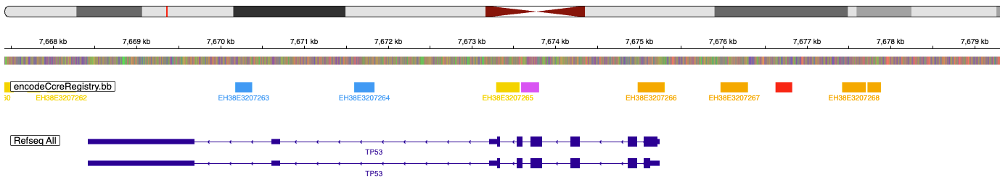

TP53 has 26 RefSeq transcripts, but IGV only shows 2 of them. We can access the settings on refSeq annotation through the gear on the right → Set track height → 700. All 26 rows appear.

- Question : What is the red feature? What is the importance of the feature and where it is located?
  - <span style="background-color: black;">It is a promoter-like element (PLS). ENCODE only assigns this class to regions near an annotated transcription start site. The main TP53 promoter is the cluster of red elements at the far right (~7,687 kb). The single red element at ~7,676.7 kb sits inside the full-length gene, in intron 1, just upstream of exon 2, which holds the start codon. Its promoter-like chromatin and a GENCODE V39 transcript starting there suggest a candidate alternative start site.</span>

### Part 2 - cBioPortal

#### Learning Objectives
- How to browse and make use of the visualization functions in cBioPortal
- Learn to query genes and datasets of interest
- Make use of visualizations to discover relationships and biological trends

Firstly, what is cBioPortal? [As per their about page, Multimodal data represented in interactive visualizations that facilitates biological discovery and clinical decisions](https://about.cBioPortal.org/). It incorporates patient-level cohort data such as mutations and clinical data.

##### Step 1 – Select the studies and build the query

Navigate to [https://www.cBioPortal.org/](https://www.cBioPortal.org/) and select the following two studies:   
  - Breast Cancer (METABRIC, Nature 2012 & Nature Commun 2016)
    - Consists of 2,509 samples of targeted sequencing on primary tumours with 549 normal matched
  - Breast Invasive Carcinoma (TCGA, PanCancer Atlas)
    - 1,084 samples as part of a large cohort that profiled 10,000 tumours across 33 cancer types

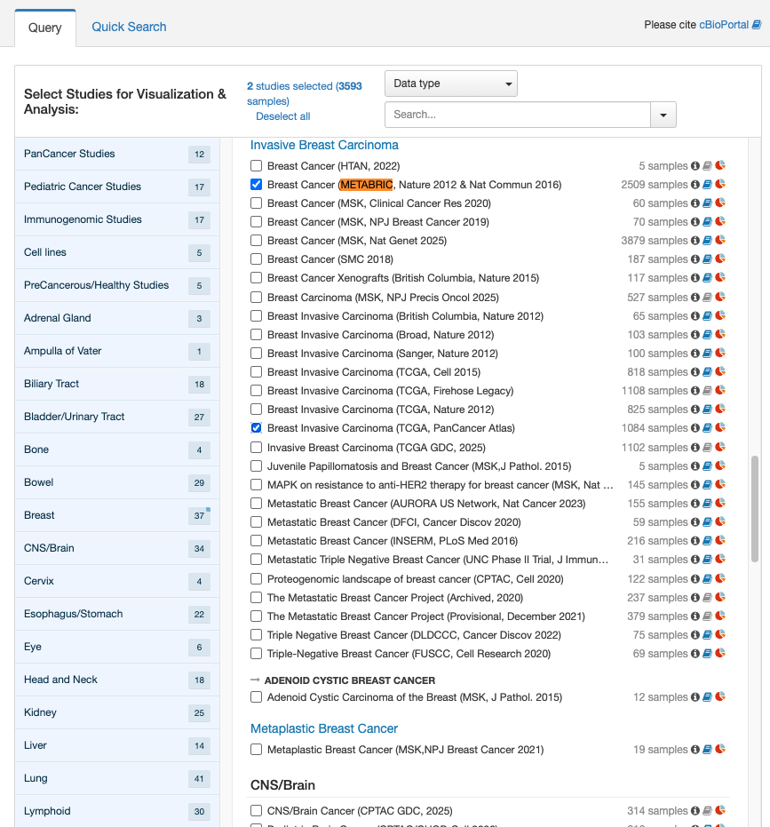 

Click "query by gene" at the footer and query the following :
```
TP53 PIK3CA BRCA1 BRCA2 PTEN STK11 CDH1 PALB2 CHEK2 ATM BARD1 RAD51C RAD51D FGFR2 TOX3 MAP3K1 ESR1 ERBB2 GATA3
```

These genes are commonly altered in breast cancer, and working with them in the tutorial will provide some insight of their significance.

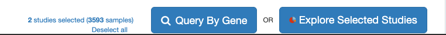 
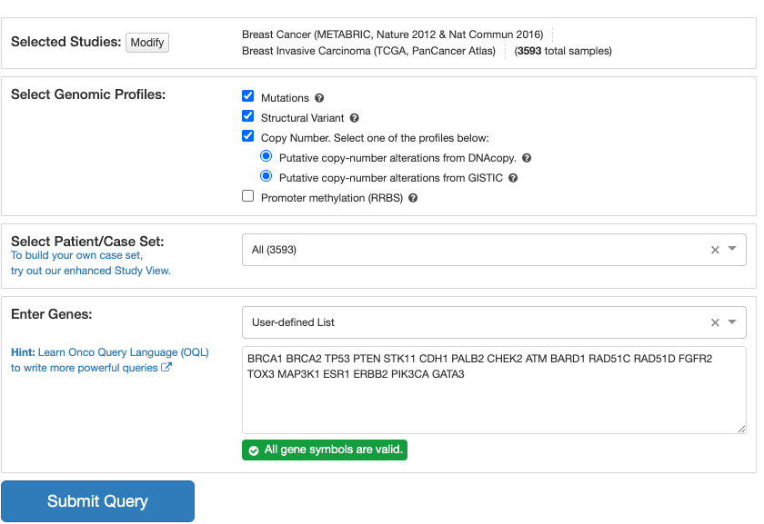  

##### Step 2 – OncoPrint

We are presented with an OncoPrint  
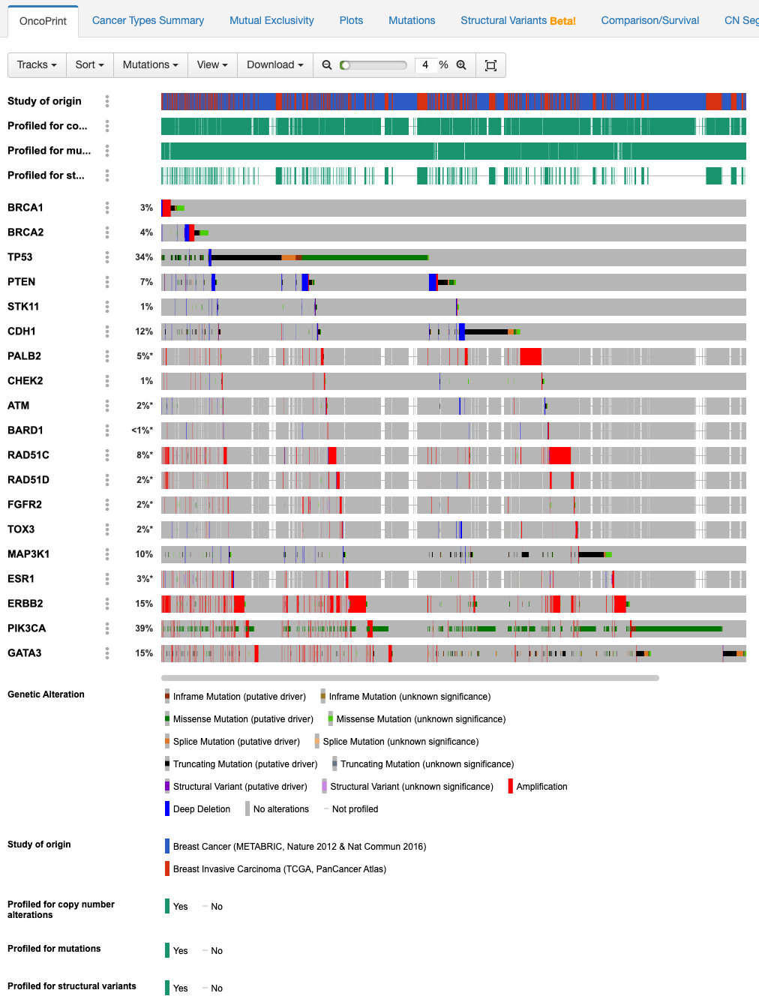 
- Question : What do the first four rows present and mean?
  - <span style="background-color: black;">As indicated in the legend, the first four rows provide info on donors' membership in the respective datasets and whether they were profiled for copy number changes, mutations, and structural variants.</span>
- Question : We see multiple genes, focusing on `TP53` and `PIK3CA`, what can we infer?
  - <span style="background-color: black;"> The percentage represents the number of donors with genetic alterations, where the legend specifies the type and proportion of donors</span>

##### Step 3 – Cancer Types Summary

On the above tabs, navigate to the cancer types summary view   

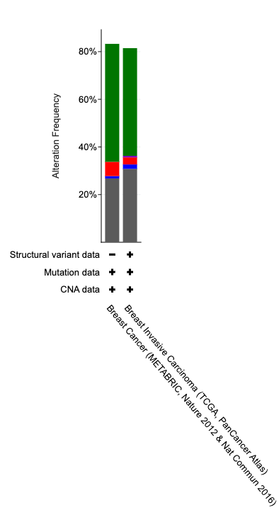

- Question : What does the barchart summarize for us?
  - <span style="background-color: black;"> X-axis gives info on the dataset and included profiled genomic alteration types. The Bars provide a frequency of genomic alterations.</span>

##### Step 4 – Mutual Exclusivity

Moving on to mutual exclusivity, select significant only and sort by q-value starting with lowest/most significant

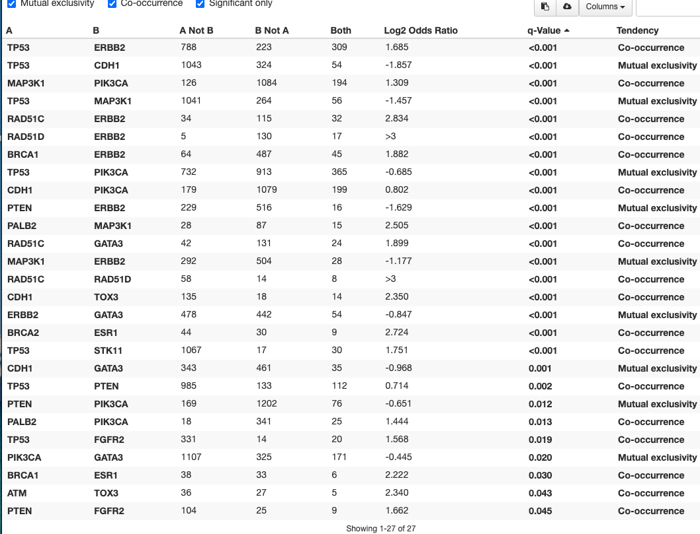

The first row denotes TP53 and ERBB2.
- Question : What does the finding of co-occurrence entail?
    - <span style="background-color: black;">Based on the two datasets, TP53 and ERBB2 are often both found to be altered</span> 
  - [Perhaps an interesting link to look at](https://pmc.ncbi.nlm.nih.gov/articles/PMC3465532/#:~:text=The%20HER2%2DEnriched%20subtype%20\(HER2E\)%2C%20which%20has%20frequent%20HER2/ERBB2%20amplification%20\(80%25\)%2C%20had%20a%20hybrid%20pattern%20with%20a%20high%20frequency%20of%20TP53%20\(72%25\)%20and)

Looking at the second row of TP53 and CDH1
  - Question : What does the finding of mutual exclusivity entail?
    - <span style="background-color: black;">Very few examples exist in the two breast cancer datasets where both TP53 and CDH1 co-occur, in fact most donors have one or the other. This could signify a dependency specific to the cancer type.</span>

##### Step 5 – Plots

Exploring the plots tab next. Let's use the quick filter for FGA vs Dx

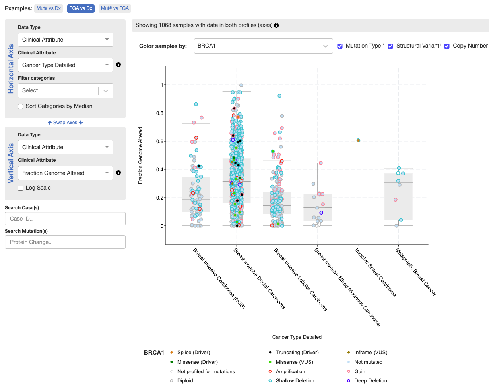 

  - Question : What info can we glean from the plot? 
    - <span style="background-color: black;">The TCGA datasets are split up into various types of breast carcinomas. Breast invasive ductal carcinoma shows the highest fraction of genome altered, signifying genomic instability.</span>

- Let's look at the mutations tab, specifically for gene TP53 

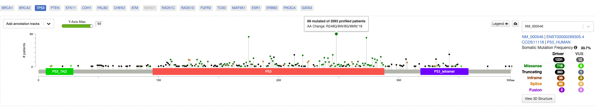  

##### Step 6 – Mutations

  - Let's look at the mutation with the highest donor count  
    - Question : Where does it occur in TP53?
      - <span style="background-color: black;">In the TP53 region that binds DNA. Amino acid 248</span>  
    - Question : What type of mutation is it?
      - <span style="background-color: black;"> Different types, but often missense</span>  
    - Question : Are there any Post-Translational Modifications associated with the mutation?
      - <span style="background-color: black;">On the left, we can add annotation tracks. Specifically we're interested in Post-Translational Modifications (PTM). Scrolling around, no modification coincides with the mutation.</span>  
  
Speaking of annotations, what if we wanted to find out more about the mutation? What can we look up through OncoKB?

- Hovering over the first row of the mutations table, note the record of sample ID `MB-0211` with the protein change `R248Q`
- Hover on the dartboard icon under the column annotation
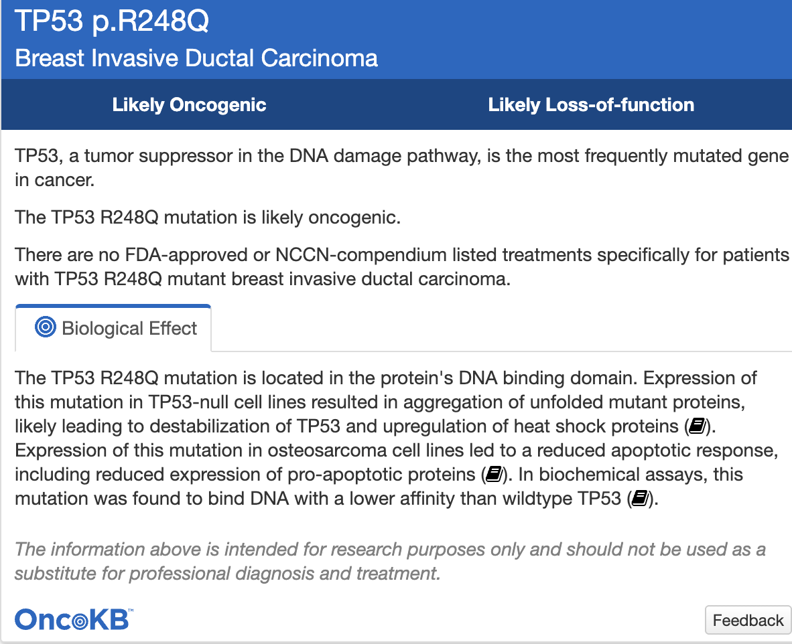  

##### Step 7 – Comparison/Survival

- Looking at survival curves. 
  - Question : What can we understand about TP53 vs unaffected cohort (no alteration in any of the 19 queried genes)?
    - <span style="background-color: black;">Patients with TP53 mutations initially have poorer survival odds but around 180-200 months have better outcomes compared to the unaffected cohort.</span>
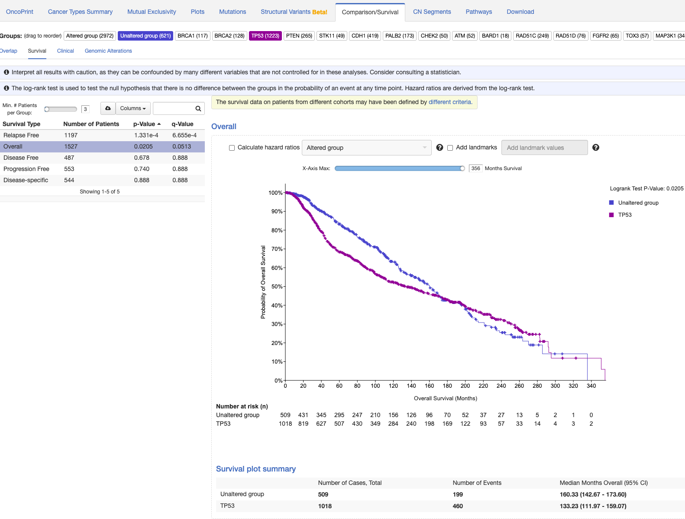  

##### Step 8 – CN Segments

- Lastly, let's look at copy number segments which brings us back to IGV. Looking at PIK3CA vs TP53 
  - Question : what differences do we observe?
    - <span style="background-color: black;">TP53 mutations are copy number losses while PIK3CA mutations are copy number gains.</span>

### Part 3 - COSMIC

COSMIC (Catalogue of Somatic Mutations in Cancer) is a curated knowledge base of somatic mutations drawn from the literature and large-scale studies, along with data from other assays (e.g., methylation) and analyses (e.g., drug resistance).

An example use-case would be exploration with cBioPortal to find trends and patterns followed up with validation and annotating significance in COSMIC.

#### Learning Objectives
- How to browse and make use of the visualization functions in COSMIC
- Navigate datasets by refining the search using visualization functions 

Navigate to [COSMIC](https://cancer.sanger.ac.uk/cosmic). You'll need an account to access the data. Follow the prompts at the following link : https://cancer.sanger.ac.uk/cosmic/register

##### Step 1 – Search for a gene

Search for `TP53` in the header search bar


Additionally, ensure you're on the correct genome build GRCh38. The search returns the results page which groups hits by type (Genes, Mutations, Samples, Cancers, etc.). We need to choose the gene TP53 to open the gene page.

##### Step 2 – Read the gene view
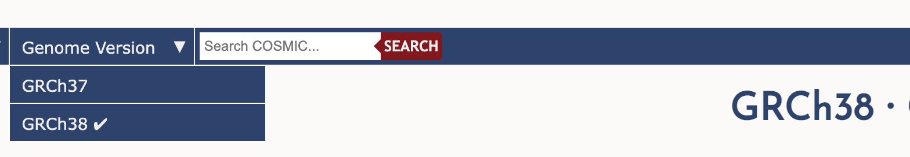

The central gene view plot displays various types of info along the length of the gene.

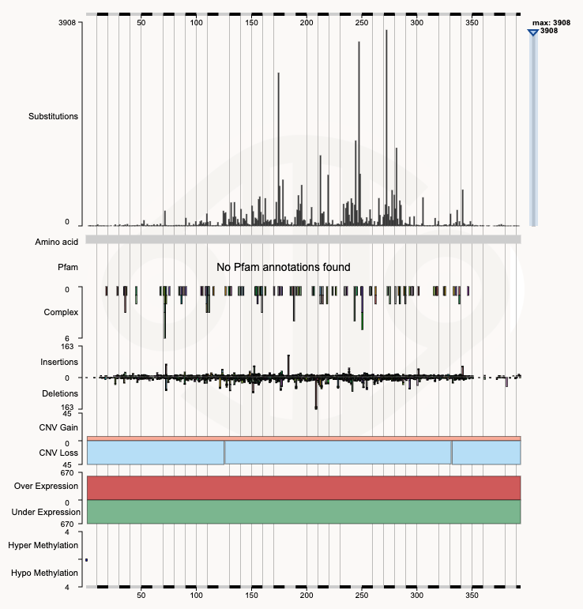

Hovering on the top substitution, we'll find the position to be `273`. We can further zoom in to that region for more info. 


##### Step 3 – Zoom to positions 270–275

Apply the filters on the left-hand side for `270-275`.


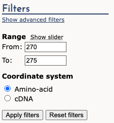

The result is the following barchart of substitutions.

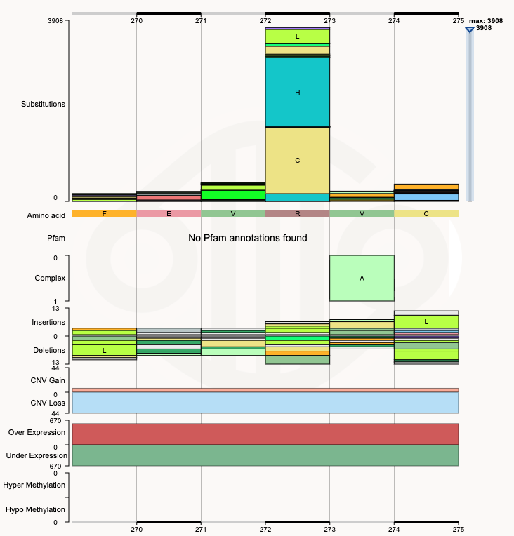

  - Question : Which substitution is the most common at position `273` of the TP53 gene?
    - <span style="background-color: black;">p.R273H (c.818G>A) 1551</span>

##### Step 4 – Open the mutation page

Clicking on the mutation brings us to a page dedicated to the mutation. Here, a number of interesting things can be viewed, including samples with the mutation, related references, and pathways.
- The shape is the same (missense hotspots in the DNA-binding domain plus truncations everywhere), but COSMIC's top hotspot is R273 across all cancers, while in cBioPortal's two breast cohorts it was R248, with R175 and R273 close behind
- Different sample collections give different rankings of the most common mutation!

We can also observe the tissue type distribution of samples with the TP53 mutations.

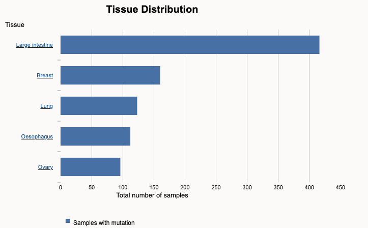

##### Step 5 – Jump to a tissue: the Cancer Browser

Clicking on the `Large Intestine` brings us to a page dedicated to `Large Intestine`. 

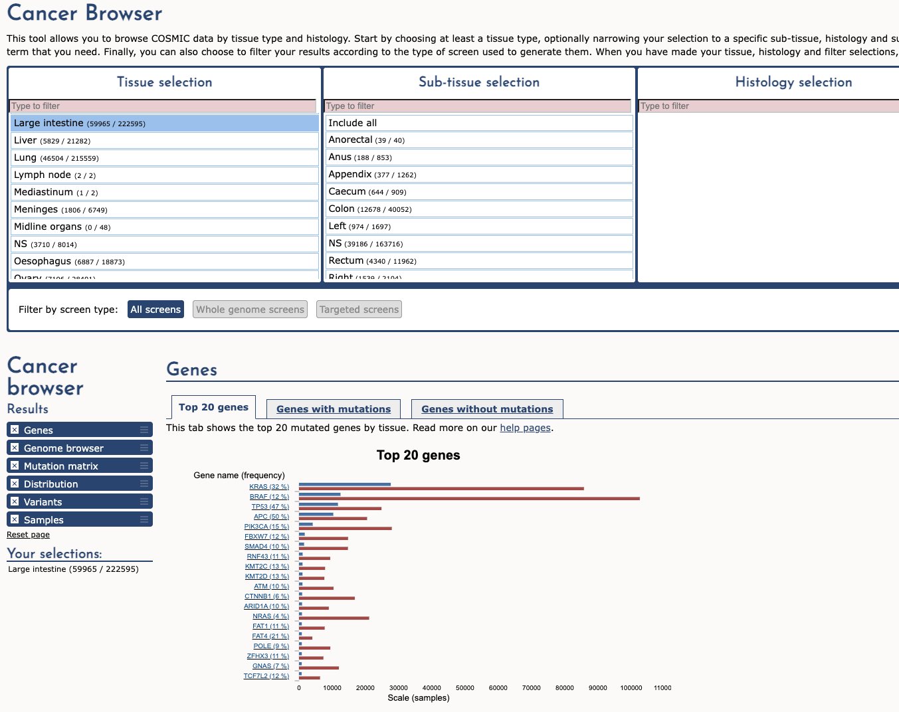

##### Step 6 – Back to TP53 with the tissue filter

We can then see the top genes mutated in Large intestinal samples. Clicking the TP53 mutation returns us to the TP53 page but with additional filters.

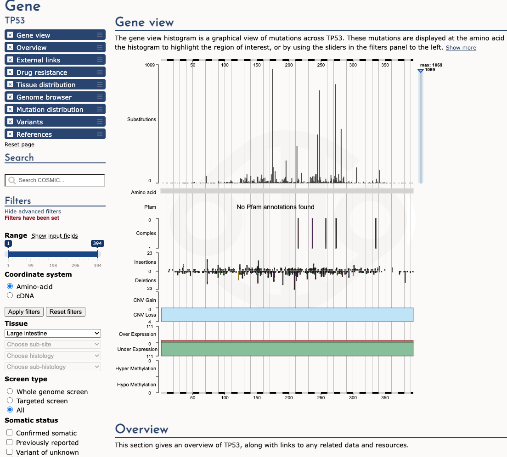

Note the left-hand filter with tissue type selection applied. The result is that the most represented mutation is now different. Previously it was `3908` at position `273` but the most frequent mutation is now `175` with `1069` mutation count. We can observe how different tissue types reflect different mutations.